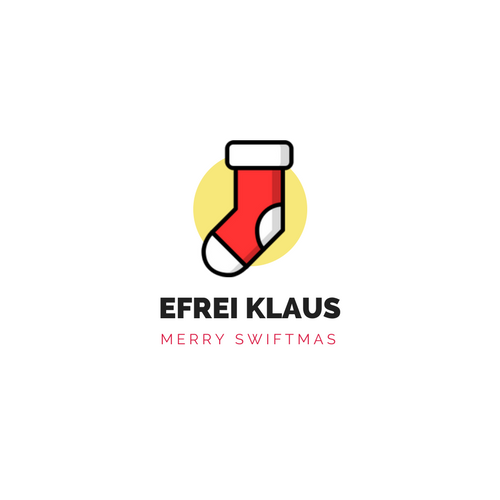

<p align="center">
  
</p>

## <a name='TOC'>📗 Summary</a>

- [Rules](#rules)
- [Overview](#overview)
- [Stack](#stack)
- [Credits](#credits)

## <a name='overview'>👮🏾‍ Rules</a>
=================

Hi, voici quelques règles pour mener à bien ce projet :)

* Ce projet DOIT être faire tout seul
* Le sujet est en français mais votre code DOIT être en anglais [`classe`, `variable`, etc.]
* Vous DEVEZ créer un dépot git pour ce projet
* Vous DEVEZ créer un diagramme `UML` de votre projet sur [LucidChart](lucidchart.com)
* Vous DEVEZ me notifier par un message privé original le COMMENCEMENT du projet ET
le PASSAGE à chaque étape.

> Bien évidemment, vous pouvez échanger entre vous, le peer-learning est la clé de
votre apprentissage MAIS la copie sera sanctionné

N'hésitez pas en cas de de question à les poser sur le channel `pragmatic` de slack,
il n'y a pas de question inutile.


## <a name='overview'>🎅🏼 Overview</a>
=================

Le père Noël a fait une demande officielle à l'Efrei pour informatiser sa chaine d'emballage de cadeaux;
La monde tend vers une robotisation et le père Noël dit SK vous demande de concevoir un simulateur de chaine d'emballage.

SK vous fournit une liste décrivant le métier de l'elfe sur la chaine d'emballage de cadeaux.
Votre chef de projet a préféré prendre les choses en main et a traité pour vous l'analyse fonctionnelle et certains aspects de conception.

Il vous fournit une liste d'indications et de contraintes pour l'implémentation des différentes parties du simulateur.

## Etape \#1. Poney et figurines Dragon Ball

Le chef de projet vous demande d'écrire les classes Toy, Pony, Figurine et DragonBall.

Il vous indique:
- Un `Pony` est un `Toy`
- Une `Figurine` est un `Toy`
- Un `DragonBall` est une `Figurine`

> 💡 Tips: qu'est ce que représente la "classe" `Toy` ?

Un jouet peut être déplacé via la méthode `isMoved`. De plus un jouet possède un
attribut `type` de type `String` accessible via un **getter**

### Hi, poney

Un `Pony` possède un attribut **statique** privé  `_nb` qui determine le nombre d'objet instancié.
Il est par défaut initialisé à **1**.

Cette classe possède également un attribut `id` qui est égale au numéro de l'objet.
Lorsqu'un `Pony` est instancié il affiche sur la sortie standard:

```sh
Pony #X is singing -->
Dou-double poney, j’fais izi money
D’où tu m’connais ? Parle moi en billets violets
Dou-double poney, j’fais izi money

```

> Remplacé X par l'identifiant

L'attribut type retourne la chaine de caractère `Pony #X`

Quand un `Pony` est bougé il affiche `Huuuuuuhu!`


### Dragon Ball

Une figurine `DragonBall` possède un attribut privé `_character` de type Enum `DBHeroes`
définit comme suit:

```swift
enum DBHeroes {
  case SANGOKU
  case BEJITA
  case BEERUS
  case KAMESENNIN
}
```

Pour instancier une figurine `DragonBall`, il faut spécifier le personnage via l'enum et ainsi
s'affiche sur la sortie standard:

```sh
X is singing -->
CHA-LA HEAD CHA-LA
Nani ga okite mo kibun wa heno-heno kappa
CHA-LA HEAD CHA-LA
Mune ga pachi-pachi suru hodo
Sawagu Genki-Dama --Sparking !

```

> Remplacé X par le personnage

L'attribut type de la classe retourne la chaine de caractère `Dragon Ball figurine X`

Quand un `DragonBall` est bougé il affiche `Kamé Hamé Ha!`

### TEST

Voici les fichiers que vous devriez avoir:

```sh
~/M/cdiwm-rush-efrei-klaus ❯❯❯ tree .
.
├── class.DragonBall.swift
├── class.Pony.swift
├── main.swift
├── protocol.Figurine.swift
└── protocol.Toy.swift

0 directories, 5 files
```

Voici un main suivi de la sortie que vous devriez avoir:

```swift
// Step #1
print("--- STEP #1 ---")

var pony: Pony = Pony()
var goku: DragonBall = DragonBall(DBHeroes.SANGOKU)

pony.isMoved()
goku.isMoved()
```

```sh
~/Efreitech/pp ❯❯❯ swiftc *.swift -o bin
~/Efreitech/pp ❯❯❯ ./bin
Pony #1 is singing -->
Dou-double poney, j’fais izi money
D’où tu m’connais ? Parle moi en billets violets
Dou-double poney, j’fais izi money

SANGOKU is singing -->
CHA-LA HEAD CHA-LA
Nani ga okite mo kibun wa heno-heno kappa
CHA-LA HEAD CHA-LA
Mune ga pachi-pachi suru hodo
Sawagu Genki-Dama --Sparking !

Huuuuuuhu!
Kamé Hamé Ha!
````

## Etape \#2. Une histoire d'emballage

Il faut maintenant être capable de gérer l'emballage des cadeaux:

#### Préparation

* Une `Box` est un `Packaging`
* Un `GiftWrap` est aussi un `Packaging`

> 💡 Tips: qu'est ce que représente la "classe" `Packaging` ?

Un `Packaging` possède 2 attributs:
* `isOpen` un booléen qui permet de savoir s'il est ouvert ou fermé
* `toy` un jouet qui correspond à celui qui est emballé

Par défaut un emballage est fermé et il n'y a pas de jouet emballé

> 💡 Tips: Valeur par défaut d'un jouet -- https://goo.gl/JF8SAv

Un `Packaging` possède 2 méthodes:
* `open` qui permet d'ouvrir un emballage
* `insert` qui prend un jouet en paramêtre et permet de l'emballer

Lorsqu'un objet est emballé, l'emballage devient fermé.

> 💡 Tips: Lorsqu'une méthode modifie un attribut elle n'est plus immutable, ie
qui ne change pas le comportement de l'objet (choix par défaut).
Comment faire pour que les méthodes ci-dessus soit mutable?

### Factorisation

Les protocoles c'est bien mais l'implémentation des classes `Box` et `GiftWrap`
n'est-elle pas un duplicat?
Oui car la logique est la même pour ces 2 classes et ce n'est pas une bonne pratique.

Heureusement, il existe un moyen d'implémenter une seule fois une même logique d'un protocol.
Il s'agit des `extension` --> swift skill++ yeaaaaah :)

#### Les elfes entrent dans le Game

Un `Elf` est une classe qui possède un attribut `nickname` de type `String` avec
**getter**+**setter**

Lorsque l'on crée un Elf, on doit spécifié son `nickname`

### Pack

Un elf peut emballer un cadeau [et un seul] via une méthode `pack` qui prend en
paramêtre un `Packaging` et un `Toy`

Si l'emballage est fermé, l'elf dit: `Sorry this package is not open`
Si l'emballage possède déjà un cadeau, l'elf dit: `Sorry this package already filled`

Sinon, le cadeau est ajouté à l'emballage et l'elf dit:
`Yeaaaah! Just packing the toy ~~ X ~~`

> Remplacé X par le type du jouet

Attention, un papier cadeau n'a pas besoin d'être ouvert pour emballer.

> 💡 Tips: Cette méthode modifie le comportement d'un objet passé en paramêtre (packaging).
Comment faire pour que le changement effectué au sein de la méthode soit "réellement" effectif ?

#### Unpack

Un elf peut déballer un cadeau via une méthode `unpack` qui prend en paramêtre un
`Packaging`

Si l'emballage est ouvert ou qu'il n'y a pas de cadeau, l'elf dit:
`Sorry this package is already empty`

Sinon, le cadeau est enlevé de l'emballage et l'elf dit:
`Ooooooh! Just unpacking the toy ~~ X ~~`

Le jouet à l'intérieur de l'emballage est retourné

> Remplacé X par le type du jouet

### TEST

Voici les fichiers que vous devriez avoir:

```sh
~/M/cdiwm-rush-efrei-klaus ❯❯❯ tree .
.
├── class.Box.swift
├── class.DragonBall.swift
├── class.Elf.swift
├── class.GiftWrap.swift
├── class.Pony.swift
├── extension.Packaging.swift
├── main.swift
├── protocol.Figurine.swift
├── protocol.Packaging.swift
└── protocol.Toy.swift

0 directories, 10 files
```

Voici un main suivi de la sortie que vous devriez avoir:

```swift
...

// Step #2
print("--- STEP #2 ---")

var majdi: Elf = Elf(nickname: "makiboto")
var box: Packaging = Box()
majdi.pack(packaging: &box, toy: goku)
box.open()
majdi.pack(packaging: &box, toy: goku)

var paper: Packaging = GiftWrap()
majdi.pack(packaging: &paper, toy: pony)
majdi.pack(packaging: &paper, toy: pony)

var toy: Toy! = majdi.unpack(packaging: &paper)
print(toy as! Pony === pony)
var r: Toy? = majdi.unpack(packaging: &paper)
print(r == nil)

```

```sh
Pony #1 is singing -->
Dou-double poney, j’fais izi money
D’où tu m’connais ? Parle moi en billets violets
Dou-double poney, j’fais izi money

SANGOKU is singing -->
CHA-LA HEAD CHA-LA
Nani ga okite mo kibun wa heno-heno kappa
CHA-LA HEAD CHA-LA
Mune ga pachi-pachi suru hodo
Sawagu Genki-Dama --Sparking !

Huuuuuuhu!
Kamé Hamé Ha!
Sorry this package is not open
Yeaaaah! Just packing the toy ~~ Dragon Ball figurine SANGOKU ~~
Yeaaaah! Just packing the toy ~~ Pony #1 ~~
Sorry this package already filled
Ooooooh! Just unpacking the toy ~~ Pony #1 ~~
true
Sorry this package is already empty
true
```

## Etape \#3. Tapis qui roule et Fabrique

### Mise en place

Il faut maintenant être capable de gérer le poste de travail :

Avant toute chose, il faut savoir que tout est `Object`, ie les jouets et les emballages.

L'elfe a une `Table` devant lui et un `ConveyorBelt` (tapis roulant) à côté de lui.
C'est deux entités sont des meubles aka `Furniture`.

L'elfe peut poser et prendre sur un meuble des objets via les méthodes `put` et `take`.

On ne peut rien poser sur le tapis roulant s'il y a déjà quelque chose, un attribut `isBusy`
nous permet de le connaître l'état de ce tapis. Par défaut, un tapis est disponible.

Quand il n'y a plus de place sur la table, elle craque et dit car elle ne peut contenir
qu'un maximum de 10 objets.
Pour cela créer un attribut `content` qui est un tableau d'`Object`.

Spécificité de la `Table`, la méthode `take` prend un objet à la fin du tableau et
il y a une méthode `take` supplémentaire qui prend en paramêtre la position de l'objet.

L'elfe reçoit des Obbjets en appuyant sur le bouton `in` du
tapis roulant ou envoie ce qu'il y a actuellement sur le tapis au père Noël en appuyant sur le bouton `out`

Un Obbjets envoyé au père Noël est considéré comme perdu, le tapis roulant est de nouveau libre.

L'elfe peut regarder via la méthode `look` sur la table pour savoir ce qu'il s'y trouve;
Il obtient un tableau avec les intitulés des différents Objets.

```sh
[ "Toy", "Toy", "Packaging", "Toy" ]
```

L'elfe peut également regarder sur le tapis roulant pour savoir ce qu'il s'y trouve.

### TEST

Voici les fichiers que vous devriez avoir:

```sh
~/M/cdiwm-rush-efrei-klaus ❯❯❯ tree .
.
├── class.Box.swift
├── class.ConveyorBelt.swift
├── class.DragonBall.swift
├── class.Elf.swift
├── class.GiftWrap.swift
├── class.Object.swift
├── class.Pony.swift
├── class.Table.swift
├── extension.Packaging.swift
├── main.swift
├── protocol.Figurine.swift
├── protocol.Furniture.swift
├── protocol.Packaging.swift
└── protocol.Toy.swift

0 directories, 14 files
```

Voici un main suivi de la sortie que vous devriez avoir:

```swift
...
// Step #3
print("--- STEP #3 ---")

var table: Table = Table()
var conveyor: ConveyorBelt = ConveyorBelt()

majdi.put(furniture: table, obj: paper)
majdi.put(furniture: table, obj: pony)
majdi.put(furniture: table, obj: box)
```

### Patterns

SK vous demande d'écrire les protocoles `PTable` et `PTapisRoulant` ainsi que les classes
`TableFactory` et `ConveyorBeltFactory` implémentant ces protocoles.

La table et le tapis roulant du père Noël contiennent ce qu'il faut pour faire 2 cadeaux.

La disposition/répartition des emballages/jouets entre le tapis et la table est à votre convenance.
SK veut que vous lui fournissiez deux méthodes:

```swift
makeTable() -> PTable
makeConveyorBelt() -> PConveyorBelt
```

Ces 2 méthodes permettent de réifier (instancier) ces 2 objets.

### TEST

Voici les fichiers que vous devriez avoir:

```sh
~/M/cdiwm-rush-efrei-klaus ❯❯❯ tree .
.
├── class.Box.swift
├── class.ConveyorBelt.swift
├── class.DragonBall.swift
├── class.Elf.swift
├── class.GiftWrap.swift
├── class.Object.swift
├── class.Pony.swift
├── class.Table.swift
├── extension.Packaging.swift
├── main.swift
├── protocol.Figurine.swift
├── protocol.Furniture.swift
├── protocol.PConveyorBelt.swift
├── protocol.PTable.swift
├── protocol.Packaging.swift
└── protocol.Toy.swift

0 directories, 16 files
```

## Etape \#5. Chaussettes

### Le final

Vous DEVEZ imaginer et implémenter un moyen de faire communiquer la table et le tapis roulant avec ceux de l'un de vos camarade 😱<br />
Pour cela vous devez utiliser des chaussettes magiques.

> Le travail doit être fait en binôme, choose well

## Etape \#6. Bonus

### Le typage say bien

Tout simplement refaire le projet en TypeScript ou un autre si déjaà fait ;p

## <a name='credits'>Credits</a>

Craft with :heart: by [**Majdi Toumi**](http://majdi.im) in **Paris**.
